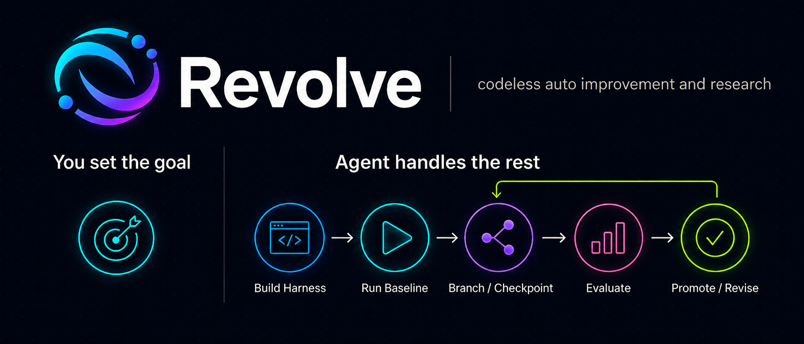

<p align="center">
  
</p>

# Revolve

Revolve is an `AGENTS.md` protocol for reproducible agentic self-improvement.

It does not provide a package, CLI, benchmark suite, or fixed evaluator. Instead,
it gives a capable coding agent a disciplined workflow for improving an artifact:
define success first, preserve the current state, explore candidate changes,
evaluate them comparably, and promote only validated improvements.

The full paper is in [paper.md](paper.md). The runnable protocol is in
[AGENTS.md](AGENTS.md).

## Core Idea

Generic self-improvement should not depend on one static harness. A prompt, code
module, workflow, dataset, model configuration, and visual review all need
different evaluation mechanics.

Revolve keeps the durable part in instructions:

1. Build or connect the right local evaluation environment.
2. Checkpoint the incumbent artifact before changing it.
3. Generate candidate branches with clear hypotheses.
4. Evaluate candidates under the same revision.
5. Record results in a local documentation hierarchy.
6. Promote, reject, revise, or stop with evidence.

## Key Concepts

- **Subject:** the artifact being improved, such as code, a prompt, config,
  policy, workflow, or generation procedure.
- **Evaluation environment:** the harness, cases, fixtures, scoring rules,
  acceptance gates, result schema, and run procedure.
- **Revision:** one comparable evaluation context. If the cases, scoring,
  harness, objective, or subject definition changes, create a new revision.
- **Checkpoint:** a recoverable subject state with a parent, rationale, result,
  status, and restore method.
- **Branch:** a search line pursuing a hypothesis.
- **Incumbent:** the currently accepted checkpoint.
- **Candidate:** a proposed improvement that must earn promotion.

## Workflow

Revolve starts by clarifying the objective and defining success. The agent then
creates or resumes `revolve/`, records the project and revision, builds the
evaluation environment, creates or imports cases, checkpoints the incumbent, and
runs a baseline before changing the subject.

Only after the baseline exists does it generate candidates. Each official run is
saved, indexed, and reflected back through the relevant checkpoint, branch, and
revision docs before the next step begins.

## Documentation Shape

Revolve uses local `AGENTS.md` files as durable research memory:

```text
revolve/
  AGENTS.md
  projects/<project-id>/
    AGENTS.md
    revisions/<revision-id>/
      AGENTS.md
      eval/AGENTS.md
      branches/<branch-id>/AGENTS.md
      checkpoints/<checkpoint-id>/AGENTS.md
      runs/AGENTS.md
      parallel/AGENTS.md
      promotion/AGENTS.md
```

Parent files summarize and route. Child files preserve local detail. This keeps
long-running improvement work resumable without turning the project into one
large research diary.

## Prompt Examples

Use language that asks the agent to improve, optimize, evolve, research
alternatives, benchmark, tune, or raise a score:

```text
Use Revolve to improve the error messages in this CLI. Define the evaluation
cases first, checkpoint the current behavior, and stop after one candidate batch.
```

```text
Optimize the image export path for latency without reducing output quality.
Create a benchmark, run the baseline, compare candidates in one revision, and
promote only if the evidence is clean.
```

```text
Research better system prompts for the support assistant. Build cases from the
existing examples, keep candidate prompts inside revolve/, and let me choose
after the first scored comparison.
```

```text
Evolve this parser for robustness. Use the existing tests, add edge cases only in
a new revision, and document every checkpoint and run.
```

## License

MIT. See [LICENSE](LICENSE).

## Credits

<p align="center">
  Created by <strong><a href="https://www.agent-zero.ai/">Agent Zero</a></strong><br>
  Open-source agentic AI framework<br>
  <a href="https://www.agent-zero.ai/">Website</a> &middot; <a href="https://github.com/agent0ai/agent-zero">GitHub repository</a>
</p>
